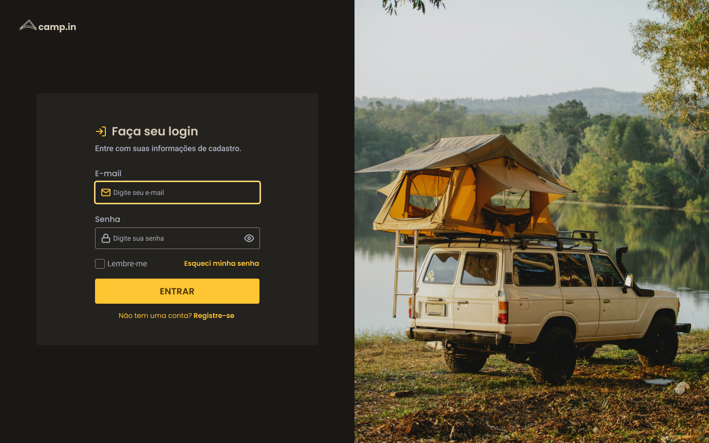

# Login-Form 🖥️

## Sobre o projeto :information_source:

Esse projeto foi tirado de um dos desafios do Discover, da plataforma [Rocketseat](https://app.rocketseat.com.br/discover).

Um projeto que tem como objetivo simular a interface de uma tela de login responsiva.

Para mais detalhes sobre o projeto você pode conferir clicando [AQUI](https://app.rocketseat.com.br/discover/challenges/pricetable).

---

## Tecnologias :wrench:

As tecnologias usadas foram:

- HTML
- CSS

---

## Preview :computer:

Acesse a página: [**Login Form**](https://matheus-lincon.github.io/sidebar/)

 

  

w